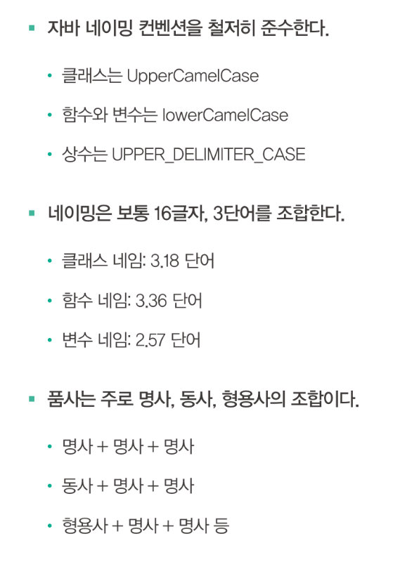

# [01] 네이밍 컨벤션, 이유를 알고 쓰자

## 이름 짓기는 창조가 아니라 조합

이름 짓기는 무에서 유를 창조하는 것이 아니다. 기존 방식이나 이름을 차용해서 새로운 이름을 짓는 경우가 대부분이다.

오픈소스의 네이밍 특징들은 몇 가지 중요한 네이밍 규칙을 데이터로 증명 했다.

## 파스칼 표기법

파스칼 표기법은 모든 단어에서 첫 글자를 대문자로 쓰는 방식이며, 주로 `클래스` 이름에 사용한다.

그 이유는 클래스가 프로그래밍에서 가장 중요하고 높은 위치에 있고, 고유명사처럼 특정되어, 명사로 돼 있기 때문이다. (인터페이스도 마찬가지다)

## 카멜 표기법

카멜 표기법은 첫 단어를 빼고 나머지 단어의 첫 번째 글자만 대문자로 쓰며, 주로 `함수나 변수`에 사용한다.

함수는 주로 동작을 시키는 명령어 개념이므로 첫 단어가 주로 `동사`다. 변수는 `형용사`로 시작하는 경우도 많다.

## 상수

상수는 모두 대문자로 쓰고 언더스코어로 단어를 연결한다.  
상수는 값이 변해서는 안된다는 점을 강조하고 주의시키기 위해 가독성을 높이는 방법으로 대문자를 선택한 것이다.

## 가독성과 소통이 먼저다

어떤 방식을 사용하던 중요하건 그렇게 쓰는 이유다. 그동안 수많은 개발자가 이렇게 컨벤션을 만든 이유는 가독성과 소통 때문이다.

하지만 가독성이 높다고 소통이 더 잘되는 것은 아니다. 소통이 잘 되려면 서로가 같은 컨벤션을 지켜야 한다.

   

# [02] 변수 이름을 잘 짓는 법

## i 는 변수 이름이지만 d 는 아니다

`"오픈소스의 네이밍 특징들"` 에 따르면 가장 많이 쓰는 변수 이름은 `i, LOG, result` 이다.   
i 는 정수를 뜻하는 integer 와 지수를 뜻하는 index 의 첫 글자로 간주되므로, 개발자가 반복문의 카운터나 배열 인덱스로 i 를 사용해도 이상할 것이 전혀 없다. i 다음에 j, k 를 쓰는 것도 전혀 어색하지 않다.

하지만 a 나 d 와 같이 `아무런 의미가 없는 글자를 변수`로 쓰는 것은 좋지 않다.

일자를 d로 표현할때가 많은데 이때 d 를 day 를 뜻한다고 사용할때가 있다. 하지만 어떤 개발자는 d 를 보고 date 나 double 을 떠올릴지도 모른다.   
일자를 뜻하는 변수를 설정하고 싶다면 day 를 사용하면 된다. 하지만 그냥 day 는 존재하지 않는다. 프로그램상 항상 어떤 의도를 가진 day 만사용한다.

결국 그냥 일자란 존재하지 않는다.

## 복수형을 나타내는 s 를 붙일까 말까?

변수명 뒤에 `-s` 를 붙이면 복수형을 쉽게 알아 볼수가 있다. 하지만 함수명 중간에 사용할때는 `-s` 가 눈에 잘 띄지 않는다.

그래서 변수명은 그냥 두더라도 함수명에서는 -s 대신 'array' 나 'list of' 를 쓰는 편이 더 나을 수가 있다.

## 중요한 단어를 앞에 쓴다

변수 이름을 여러 단어로 조합할 때는 순서를 잘 정해야한다.

요즘 개발 도구는 검색할 때 해당 단어가 포함된 클래스나 변수를 다 찾아주어 단어 조합의 순서가 중요하지 않을 수도 있지만, `중요한 것이 앞에 와야 한다`는 기본 원칙은 지키도록 하자.

## 함수 이름 짓는 순서

사용자가 할 일을 모두 없애서 문장을 간결하게 만들어야 한다. 함수는 시스템이 할 일을 나타내는 것이지 사용자가 할 일을 나타내는 것이 아니다. 따라서 함수의 주체, 즉 주어도 없앤다.

영문에서 정관사나 불필요한 단어를 빼고 of 는 앞뒤 단어를 바꾸자. 소유격도 없애자. 함수를 사용할 때 의미상 없어도 되는 단어는 없애자.
