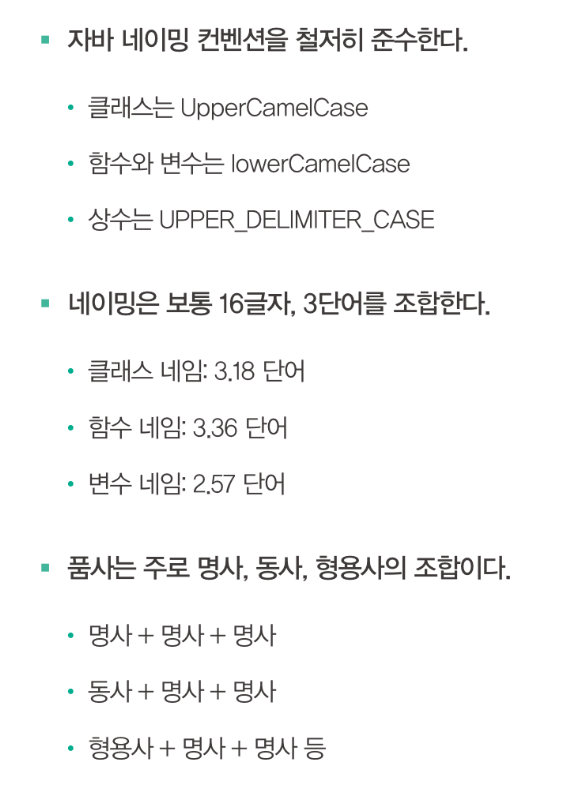

# [01] 네이밍 컨벤션, 이유를 알고 쓰자

## 이름 짓기는 창조가 아니라 조합

이름 짓기는 무에서 유를 창조하는 것이 아니다. 기존 방식이나 이름을 차용해서 새로운 이름을 짓는 경우가 대부분이다.

오픈소스의 네이밍 특징들은 몇 가지 중요한 네이밍 규칙을 데이터로 증명 했다.

## 파스칼 표기법

파스칼 표기법은 모든 단어에서 첫 글자를 대문자로 쓰는 방식이며, 주로 `클래스` 이름에 사용한다.

그 이유는 클래스가 프로그래밍에서 가장 중요하고 높은 위치에 있고, 고유명사처럼 특정되어, 명사로 돼 있기 때문이다. (인터페이스도 마찬가지다)

## 카멜 표기법

카멜 표기법은 첫 단어를 빼고 나머지 단어의 첫 번째 글자만 대문자로 쓰며, 주로 `함수나 변수`에 사용한다.

함수는 주로 동작을 시키는 명령어 개념이므로 첫 단어가 주로 `동사`다. 변수는 `형용사`로 시작하는 경우도 많다.

## 상수

상수는 모두 대문자로 쓰고 언더스코어로 단어를 연결한다.  
상수는 값이 변해서는 안된다는 점을 강조하고 주의시키기 위해 가독성을 높이는 방법으로 대문자를 선택한 것이다.

## 가독성과 소통이 먼저다

어떤 방식을 사용하던 중요하건 그렇게 쓰는 이유다. 그동안 수많은 개발자가 이렇게 컨벤션을 만든 이유는 가독성과 소통 때문이다.

하지만 가독성이 높다고 소통이 더 잘되는 것은 아니다. 소통이 잘 되려면 서로가 같은 컨벤션을 지켜야 한다.